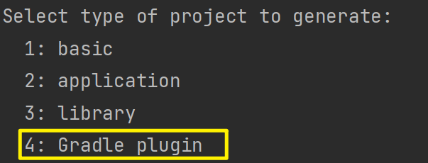
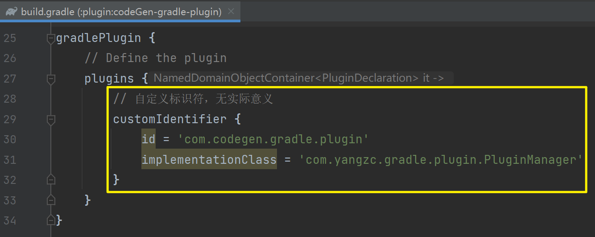
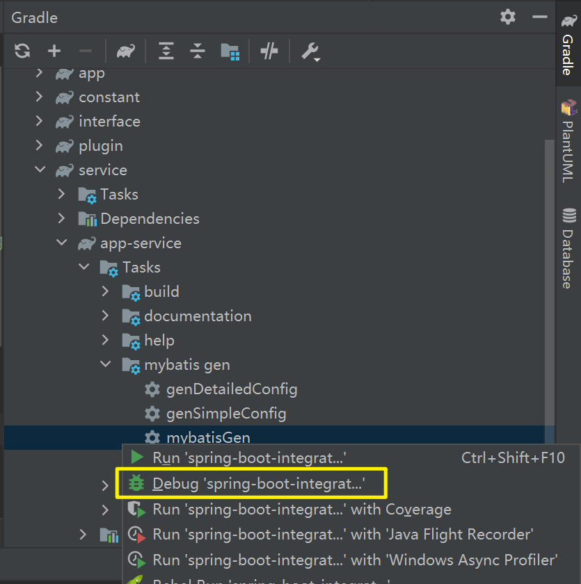

### 初始化gradle plugin module

通过gradle init来初始化gradle plugin project

项目类型选择Gradle plugin 即可




### 发布gradle plugin

#### 1. 配置插件的配置属性

通过gradle init生成项目后，在build.gradle文件中会生成插件的配置项

根据实际情况修改配置即可



- id：指定插件的唯一标识符，是在构建脚本或者项目中引用插件时使用的名称。

  也就是实际使用时的plugin id

  ```groovy
  plugins {
      id 'com.codegen.gradle.plugin' version '1.0.0'
  }
  ```

- implementationClass：指定插件的实现类，即插件的具体逻辑由哪个类来实现，具体实现类的全限定类名。


#### 2. 配置仓库信息

- 发布到远程仓库

  可以是自建的nexus，也可以是gradlePluginPortal

- 发布到本地仓库

- 打成jar包手动导入使用


#### 3. 发布gradle plugin

使用gradle中对应的publish来发布

- 发布到远程仓库

- 发布到本地仓库

  使用gradle plugin `maven-publish` 的`publishToMavenLocal` task发布到本地


### 应用gradle plugin

#### 1. 从仓库中获取plugin

在setting.gradle中添加plugin repositories

```groovy
pluginManagement {
    repositories {
        // 从本地仓库获取plugin
        mavenLocal()
  		// 添加指定 URL 地址的 Maven 仓库
        maven {
            url 'URL 地址'
        }
        // 从gradle plugin门户获取plugin
        gradlePluginPortal()
    }
}
```


在build.gradle中正常使用即可

```groovy
// build.gradle

plugins {
    // codeGen gradle plugin
    id 'com.codegen.gradle.plugin' version '1.0.0'
}
```


#### 2. 从本地获取plugin

在build.gralde中添加buildscript，指定位置和gradle plugin信息

```groovy
// 引入本地gradle plugin jar
buildscript {
    repositories {
        flatDir dirs: '../lib'
    }
    dependencies {
        classpath 'com.yangzc.gradle.plugin:codeGen-gradle-plugin:1.0.0'
    }
}
```


### 调试gradle plugin

使用IDEA开发，在开发gradle plugin项目内引入当前plugin，然后在右侧gradle 面板选择debug运行即可




